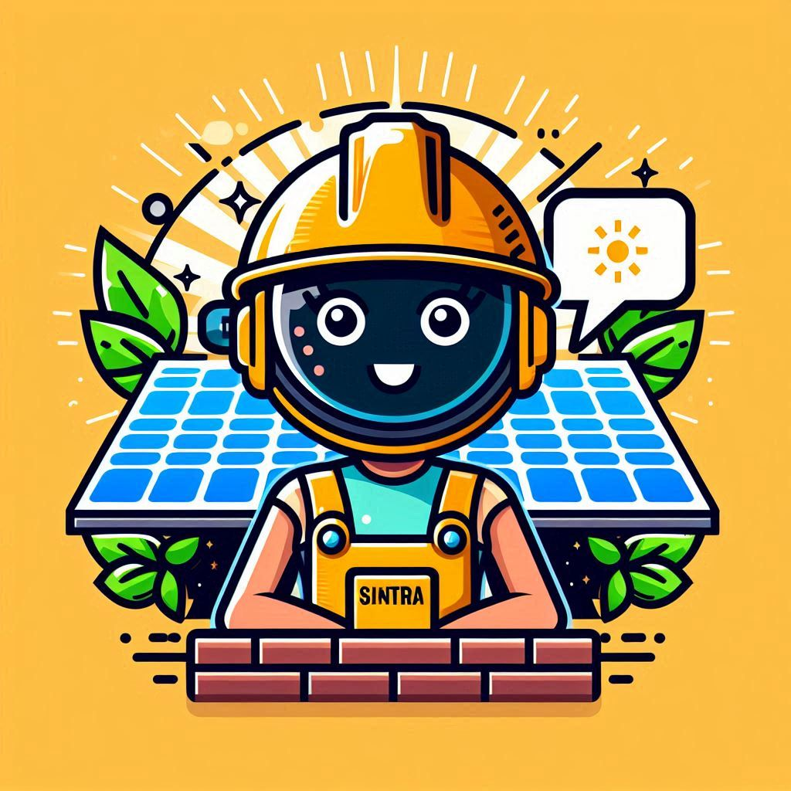

<h1 align="center">
    
</h1>

<h3 align="center">Sintra: Energia Solar Simplificada.</h3>

---
## 💻 Visão Geral:

<b>Sintra</b> é um chatbot de WhatsApp que auxilia usuários com dúvidas sobre sistemas residenciais de painéis solares, oferecendo suporte técnico e simulações de custo por meio de um <b>Simulador Solar</b>. O objetivo é tornar a energia solar mais acessível e compreensível.

O presente projeto faz parte do Trabalho de Conclusão de Curso em Análise e Desenvolvimento de Sistemas para o Instituto Federal do Rio Grande do Sul.

## :rocket: Tecnologias:

Esse projeto foi desenvolvido com as seguintes tecnologias:
- [Node.js](https://nodejs.org/en/)
- [NLP.js](https://github.com/axa-group/nlp.js)
- [VenomBot](https://github.com/orkestral/venom)
- [MySQL](https://www.mysql.com/)

## Imagens do projeto

 

 

 

 

 

 

 

 

---

<a href="https://github.com/igorzs" target="_blank">Igor Silveira</a>

